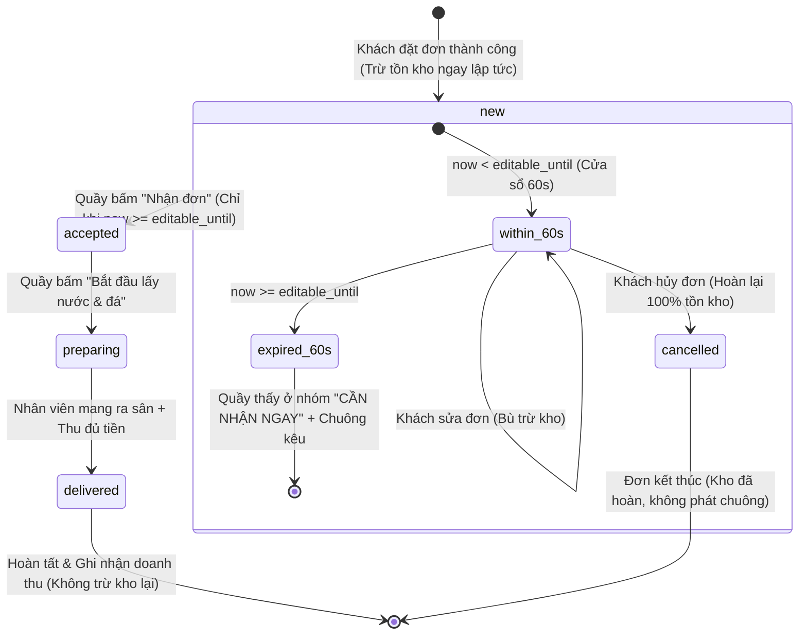

# HỆ THỐNG GỌI NƯỚC QR SÂN CẦU LÔNG TRẦN LỰU
## TÀI LIỆU CẤU TRÚC HỆ THỐNG TOÀN DIỆN & ĐẶC TẢ KIẾN TRÚC VẬN HÀNH CHUYÊN NGHIỆP

**Mã tài liệu:** `ORDER-SPEC-PRO-2026`  
**Phiên bản:** 2.0 (Master Architecture Blueprint)  
**Thương hiệu:** Sân Cầu Lông Trần Lựu  
**Quy mô triển khai:** 1 cơ sở, 16 sân thi đấu ban đầu (Sân 01 – Sân 16)  
**Ngôn ngữ:** Tiếng Việt · **Đơn vị tiền tệ:** VNĐ (nguyên) · **Múi giờ chuẩn:** Asia/Ho_Chi_Minh (UTC+7)  
**Chủ sân (GitHub Owner):** AnhToan2003  
**Đơn vị thiết kế & triển khai:** Antigravity  

---

## MỤC LỤC TỔNG QUAN

1. [TỔNG QUAN HỆ THỐNG & TẦM NHÌN DỰ ÁN](#1-tổng-quan-hệ-thống--tầm-nhìn-dự-án)
2. [30 NGUYÊN TẮC NGHIỆP VỤ BẤT BIẾN (BR-01 ĐẾN BR-30)](#2-30-nguyên-tắc-nghiệp-vụ-bất-biến-br-01-đến-br-30)
3. [KIẾN TRÚC HẠ TẦNG ĐIỆN TOÁN & MÔ HÌNH NO-CARD MIỄN PHÍ](#3-kiến-trúc-hạ-tầng-điện-toán--mô-hình-no-card-miễn-phí)
4. [THIẾT KẾ CƠ SỞ DỮ LIỆU QUAN HỆ & RÀNG BUỘC TOÀN VẸN (SCHEMA & CONSTRAINTS)](#4-thiết-kế-cơ-sở-dữ-liệu-quan-hệ--ràng-buộc-toàn-vẹn-schema--constraints)
5. [CƠ CHẾ GIAO DỊCH KHO & ĐƠN HÀNG NGUYÊN TỬ (ACID DATABASE FUNCTIONS)](#5-cơ-chế-giao-dịch-kho--đơn-hàng-nguyên-tử-acid-database-functions)
6. [HỆ THỐNG THIẾT KẾ GIAO DIỆN & TRẢI NGHIỆM NGƯỜI DÙNG (UI/UX DESIGN SYSTEM)](#6-hệ-thống-thiết-kế-giao-diện--trải-nghiệm-người-dùng-uiux-design-system)
7. [QUY CHUẨN API, XÁC THỰC BẢO MẬT & CƠ CHẾ ÂM BÁO THỜI GIAN THỰC](#7-quy-chuẩn-api-xác-thực-bảo-mật--cơ-chế-âm-báo-thời-gian-thực)
8. [QUẢN LÝ TỆP ẢNH, MÃ QR & HỆ THỐNG BÁO CÁO XUẤT EXCEL CHUẨN KẾ TOÁN](#8-quản-lý-tệp-ảnh-mã-qr--hệ-thống-báo-cáo-xuất-excel-chuẩn-kế-toán)
9. [MA TRẬN KIỂM THỬ CHẤT LƯỢNG TOÀN DIỆN (TEST MATRIX T01 – T40)](#9-ma-trận-kiểm-thử-chất-lượng-toàn-diện-test-matrix-t01--t40)
10. [LỘ TRÌNH THI CÔNG CHI TIẾT & TIÊU CHÍ BÀN GIAO (DEFINITION OF DONE)](#10-lộ-trình-thi-công-chi-tiết--tiêu-chí-bàn-giao-definition-of-done)

---

## 1. TỔNG QUAN HỆ THỐNG & TẦM NHÌN DỰ ÁN

### 1.1 Bài toán nghiệp vụ thực tế
Sân Cầu Lông Trần Lựu có 16 sân hoạt động liên tục. Người chơi sau những pha cầu căng thẳng thường có nhu cầu giải khát ngay tại chỗ nhưng gặp trở ngại:
- Phải đi bộ xa lại quầy thu ngân để gọi nước và xách về sân.
- Gián đoạn hiệp đấu, đồ đạc trên sân dễ thất lạc khi rời sân.
- Nhân viên quầy khó kiểm soát sân nào vừa gọi món gì, dễ nhầm lẫn giữa các sân lân cận.
- Vào giờ cao điểm, nhiều người cùng đến quầy gây ùn ứ, ghi chép sổ sách thủ công dẫn đến sai lệch kho và tiền bạc.

### 1.2 Giải pháp hệ thống
Hệ thống gọi nước QR Trần Lựu gồm hai phân hệ tích hợp chặt chẽ:
1. **Phân hệ Khách hàng tại sân (PWA Mobile-First)**:
   - Mỗi sân dán một bảng mã QR độc lập. Khách quét mã bằng camera điện thoại -> mở thẳng menu nước của đúng sân đó.
   - Không yêu cầu cài app, không bắt đăng ký/đăng nhập tài khoản, không bắt nhập số điện thoại.
   - Thao tác nhanh gọn bằng một tay: chọn nước, chọn số ly đá miễn phí (0 đến N ly), bấm "Đặt giao tận sân".
   - Khách có đúng **60 giây** để sửa món hoặc hủy đơn nếu đổi ý. Hết 60 giây, đơn chuyển sang quầy chuẩn bị.
   - Nhận nước tại sân và thanh toán tiền mặt/chuyển khoản cho nhân viên giao hàng.
2. **Phân hệ Quầy điều hành & Quản trị (Admin Desktop & Tablet)**:
   - Màn hình quầy thu ngân phân chia trực quan 4 cột tiến trình: `Chờ xác nhận (<60s)` -> `CẦN NHẬN NGAY (>=60s)` -> `Đang chuẩn bị` -> `Đã giao & Thu tiền`.
   - Các đơn hàng được phân nhóm theo từng sân (Sân 05, Sân 08, Sân 12...) với tiêu đề sân nổi bật nhất.
   - Hệ thống âm thanh chuông đôi ngân vang tự động báo động khi đơn qua 60 giây, lặp lại mỗi 5 giây cho đến khi nhân viên bấm nhận đơn.
   - Quản lý toàn diện: Bật/tắt nhận đơn toàn sân, CRUD danh mục nước & hình ảnh, kiểm soát tồn kho tức thời, xuất bộ mã QR (PNG & PDF in ấn 16 sân), báo cáo doanh thu theo bộ lọc và xuất file Excel đối chiếu chuẩn kế toán.

### 1.3 Mục tiêu thẩm mỹ & Cải tiến triệt để so với bản cũ
Bản thử nghiệm cũ đã bị Chủ sân từ chối vì giao diện mang tính chất "template công nghiệp", banner quảng cáo che khuất thực đơn, màu sắc xỉn màu và trải nghiệm đặt món rườm rà. Bản mới xác lập các chuẩn mực:
- **Ngay trong tầm mắt (Above the fold)**: Không có hero banner quảng cáo khổng lồ. Mở trang là thấy ngay Badge nhận diện sân (`VỊ TRÍ: SÂN 05`) và danh sách đồ uống mát lạnh.
- **Bản sắc thể thao hiện đại**: Bộ màu thương hiệu Xanh sân đấu (`#137A49`) + Xanh rừng sâu (`#12432E`), điểm xuyết Xanh vôi quả cầu lông (`#D5EF76`) trên nền sáng trang nhã (`#FFFFFF`, `#F4F7F4`).
- **Typography Be Vietnam Pro**: Phông chữ tiếng Việt chuẩn mực, nét chữ khỏe khoắn, hỗ trợ hiển thị hoàn hảo dấu câu tiếng Việt trên mọi dòng điện thoại di động (iPhone, Samsung, Xiaomi...).

---

## 2. 30 NGUYÊN TẮC NGHIỆP VỤ BẤT BIẾN (BR-01 ĐẾN BR-30)

Mọi dòng mã backend, frontend, database triggers và giao dịch kho phải tuân thủ nghiêm ngặt 30 quy tắc cốt lõi:

| Mã quy tắc | Tên quy tắc | Ý nghĩa & Cơ chế thực thi bắt buộc |
|---|---|---|
| **BR-01** | Quy mô 16 sân ban đầu | Khởi tạo sẵn `Sân 01` đến `Sân 16`. Hệ thống hỗ trợ quản lý thêm/sửa/xóa sân thông qua giao diện quản trị. |
| **BR-02** | Mã QR độc lập theo Sân | Mỗi sân định danh bằng một `court_id` (UUID v4) bất biến. Thay đổi tên hiển thị của sân không làm hỏng URL mã QR đã in. |
| **BR-03** | Khách không đăng nhập | Khách quét mã truy cập tức thì. Danh tính được gắn qua Cookie phiên an toàn (`HttpOnly`, `SameSite=Lax`, `Secure`). Tuyệt đối không bắt nhập SĐT/Email. |
| **BR-04** | Giỏ hàng đa sản phẩm | Cho phép chọn nhiều món nước khác nhau trong 1 lần đặt. Hiển thị ảnh, tên, dung tích, giá, tăng/giảm số lượng và xóa dòng linh hoạt. |
| **BR-05** | Một lượt gửi là một đơn | Mỗi lần bấm "Đặt nước" tạo ra 1 đơn hàng độc lập, gắn mã hiển thị riêng (VD: `#TL-0501`). Hoàn tất thanh toán từng đơn khi giao. |
| **BR-06** | Quản lý nhóm theo Sân | Giao diện Quầy gom các đơn theo tiêu đề Sân nổi bật (Sân 05 có những đơn nào) để nhân viên dễ gom đồ mang đi, **nhưng KHÔNG tự động gộp hóa đơn cả buổi thành một khoản nợ treo**. |
| **BR-07** | Trả tiền khi nhận hàng | 100% thanh toán tiền mặt hoặc chuyển khoản trực tiếp cho nhân viên khi mang nước ra sân. Không tích hợp cổng trung gian phức tạp. |
| **BR-08** | Tiến trình 4 bước chuẩn | Tiến trình trạng thái duy nhất: `Mới (new)` -> `Đã nhận (accepted)` -> `Đang chuẩn bị (preparing)` -> `Đã giao (delivered)`. |
| **BR-09** | Cửa sổ 60s cho khách | Khách chỉ được quyền xem, sửa món hoặc hủy đơn trong đúng 60 giây đầu tiên tính từ lúc server ghi nhận (`now < editable_until`). |
| **BR-10** | Quầy nhận sau 60s | Quầy chỉ được bấm "Nhận đơn" khi `now >= editable_until`. Hết 60s không tự động chuyển sang `accepted`, bắt buộc nhân viên phải bấm nhận để kiểm soát. |
| **BR-11** | Bảo mật đơn riêng tư | Trình duyệt của khách chỉ xem được các đơn do chính phiên duyệt đó tạo ra, không xem được đơn của người khác dù ngồi cùng một sân. |
| **BR-12** | Cấm nhân viên hủy đơn | Giao diện Quầy tuyệt đối không có nút "Hủy đơn" để chống tiêu cực và thất thoát. Chỉ khách mới được hủy trong cửa sổ 60 giây. |
| **BR-13** | Ly đá miễn phí (0..N) | Mỗi chai nước được chọn tối đa 1 ly đá (0đ). Mua 3 chai được chọn 0, 1, 2 hoặc 3 ly đá. Không quản lý số lượng tồn kho đá. Giảm chai tự kẹp số đá. |
| **BR-14** | Trừ kho nguyên tử | Đặt hàng trừ kho ngay lập tức. Khách sửa đơn sẽ bù trừ chênh lệch tồn. Khách hủy đơn sẽ hoàn lại kho. Khi giao hàng không trừ kho lần thứ hai. |
| **BR-15** | Ẩn sản phẩm hết hàng | Sản phẩm có tồn kho `stock = 0` tự động ẩn trên màn hình khách, nhưng vẫn hiển thị trên màn hình quản lý để nhân viên nhập thêm hàng. |
| **BR-16** | Chuông báo quầy tự động | Chuông chỉ kêu khi có đơn đã qua mốc 60 giây mà quầy chưa bấm nhận (`new` và `now >= editable_until`). Chuông lặp mỗi 5 giây cho đến khi nhận hết đơn. |
| **BR-17** | Tài khoản quản lý duy nhất | Một tài khoản quản trị duy nhất bảo vệ qua Supabase Auth, không mở cổng đăng ký tài khoản công khai. |
| **BR-18** | CRUD sản phẩm toàn diện | Hỗ trợ thêm mới, tải ảnh đại diện, đặt giá nguyên VNĐ, kiểm soát tồn kho, phân loại đồ uống và xóa mềm (soft-delete). |
| **BR-19** | CRUD sân & Xuất mã QR | Hỗ trợ thêm/sửa tên sân, tải ảnh QR PNG từng sân chất lượng cao và tải tệp PDF dàn trang toàn bộ 16 sân sẵn sàng in ép plastic. |
| **BR-20** | Bảo tồn lịch sử khi xóa | Đơn hàng cũ giữ nguyên snapshot tên món và giá lúc mua. Xóa mềm sân hoặc món nước không làm sai lệch số liệu doanh thu lịch sử. |
| **BR-21** | Chặn xóa sân có đơn mở | Không cho phép xóa bất kỳ sân nào đang có đơn chưa hoàn tất (kể cả đơn đang trong 60 giây, đã nhận hay đang chuẩn bị). |
| **BR-22** | Đã giao = Đã thu tiền | Chuyển trạng thái sang `Đã giao` đồng nghĩa nhân viên đã thu đủ tiền từ khách. Doanh thu của đơn hàng chỉ ghi nhận đúng một lần tại mốc này. |
| **BR-23** | Báo cáo doanh thu đa chiều | Thống kê theo ngày, tháng, khoảng ngày, theo từng sân, theo từng sản phẩm, món bán chạy nhất, danh sách đơn chưa thanh toán và lịch sử. |
| **BR-24** | Cấm tự ý xóa lịch sử | Hệ thống tối ưu truy vấn phân trang (pagination/cursor). Xuất báo cáo Excel không làm mất dữ liệu đơn hàng trong cơ sở dữ liệu. |
| **BR-25** | Công tắc mở/tắt nhận đơn | Công tắc tổng tại quầy; khi tắt nhận đơn, khách không thể tạo đơn mới nhưng các đơn đã đặt trước đó vẫn được xử lý và theo dõi bình thường. |
| **BR-26** | Không rào cản vị trí | Không bắt định vị GPS, không bắt cùng mạng Wi-Fi nội bộ, không bắt nhập mã bảo mật theo buổi chơi để tránh nghẽn thao tác. |
| **BR-27** | Dữ liệu mẫu thay thế bằng UI | Dữ liệu demo khởi tạo ban đầu có thể xóa hoặc sửa trực tiếp trên giao diện; hệ thống không tự động seed lại dữ liệu mà người dùng đã xóa. |
| **BR-28** | Bản địa hóa Việt Nam | Ngôn ngữ 100% tiếng Việt, định dạng tiền tệ VNĐ có phân cách hàng nghìn (VD: `20.000đ`), mốc ngày giờ hiển thị chuẩn UTC+7. |
| **BR-29** | Thiết kế Xanh lá & Trắng | Áp dụng trọn vẹn bảng màu thể thao đặc trưng, độ tương phản chuẩn WCAG AAA, giao diện tối ưu thao tác ngón tay cái. |
| **BR-30** | Hạ tầng Free No-Card | Vận hành trên nền tảng Cloudflare Workers và Supabase hoàn toàn miễn phí không đòi hỏi khai báo thẻ ngân hàng. |

---

## 3. KIẾN TRÚC HẠ TẦNG ĐIỆN TOÁN & MÔ HÌNH NO-CARD MIỄN PHÍ

### 3.1 Sơ đồ phân tầng hệ thống (Architecture Diagram)

```text
┌───────────────────────────────────────────────────────────────────────────────────┐
│                           CLIENT / FRONTEND LAYER                                 │
│  ┌───────────────────────────────────────┐   ┌─────────────────────────────────┐  │
│  │   Mobile Customer PWA (Tại sân)       │   │   Admin Counter App (Quầy)      │  │
│  │   - Quét QR sân (court_id)            │   │   - 4 Cột tiến trình đơn        │  │
│  │   - Chọn nước + Ly đá miễn phí        │   │   - Chuông Web Audio 5s         │  │
│  │   - Đếm ngược 60s thời gian thực      │   │   - CRUD Sản phẩm / Sân / QR    │  │
│  │   - Theo dõi phiên duyệt bảo mật      │   │   - Báo cáo thống kê & Excel    │  │
│  └───────────────────────────────────────┘   └─────────────────────────────────┘  │
└─────────────────────────────────────────┬─────────────────────────────────────────┘
                                          │ HTTPS (Cùng Origin)
                                          ▼
┌───────────────────────────────────────────────────────────────────────────────────┐
│                    EDGE GATEWAY — CLOUDFLARE WORKERS ($0/tháng)                   │
│  ┌───────────────────────────────────────┐   ┌─────────────────────────────────┐  │
│  │   Static Assets Engine                │   │   Hono API Microservice         │  │
│  │   - Single Page App (Vite+React+TS)   │   │   - Routing & Middleware        │  │
│  │   - Bundle nén gzip ~58 KB            │   │   - Kiểm tra CSRF & CORS Origin │  │
│  │   - Miễn phí không giới hạn request   │   │   - Quản lý HttpOnly Session    │  │
│  │   - Global CDN Cache Edge             │   │   - CPU limit 10ms / 100k req   │  │
│  └───────────────────────────────────────┘   └─────────────────────────────────┘  │
└─────────────────────────────────────────┬─────────────────────────────────────────┘
                                          │ HTTPS / Supabase Client (Service Role RPC)
                                          ▼
┌───────────────────────────────────────────────────────────────────────────────────┐
│                     BACKEND SERVICES — SUPABASE ($0/tháng)                        │
│  ┌─────────────────────────────────────────────────────────────────────────────┐  │
│  │   Managed PostgreSQL Database (500 MB Free)                                 │  │
│  │   - PostgreSQL 15+ ACID Engine                                              │  │
│  │   - Stored Procedures (RPC): fn_place_order, fn_edit_order, fn_cancel...    │  │
│  │   - Pessimistic Row Locking (SELECT FOR UPDATE) chống Race Condition        │  │
│  │   - Snapshot giá & bảo toàn lịch sử giao dịch                               │  │
│  └─────────────────────────────────────────────────────────────────────────────┘  │
│  ┌───────────────────────────────────────┐   ┌─────────────────────────────────┐  │
│  │   Supabase Storage (1 GB Free)        │   │   Supabase Auth                 │  │
│  │   - Bucket: product-images (Public)   │   │   - Tài khoản Quầy duy nhất     │  │
│  │   - Tự động nén WebP (<150 KB/ảnh)    │   │   - JWT có hạn & Refresh token  │  │
│  │   - KHÔNG dùng R2 (tránh yêu cầu thẻ) │   │   - Allowlist User ID bảo vệ    │  │
│  └───────────────────────────────────────┘   └─────────────────────────────────┘  │
└───────────────────────────────────────────────────────────────────────────────────┘
```

### 3.2 Báo cáo thẩm định Hosting No-Card (Bảo đảm $0 và không nhập thẻ)
1. **Cloudflare Workers**:
   - Gói Free cung cấp **100.000 requests/ngày** cho logic API.
   - Tính năng **Static Assets** phục vụ giao diện tĩnh là **hoàn toàn miễn phí và không tính vào hạn mức 100.000 requests**.
   - Đăng ký và kích hoạt dự án 100% không đòi hỏi khai báo thẻ thanh toán quốc tế.
   - **Quyết định loại trừ Cloudflare R2**: Dù Cloudflare có gói R2 10 GB miễn phí nhưng bắt buộc phải nhập thẻ tín dụng để kích hoạt tính năng thanh toán. Do đó, hệ thống loại bỏ R2 hoàn toàn.
2. **Supabase Free Tier**:
   - Cung cấp **500 MB** cơ sở dữ liệu PostgreSQL chuyên dụng, **1 GB** file storage và **50.000 MAU** Auth.
   - Đăng ký bằng tài khoản GitHub (AnhToan2003), không bắt buộc nhập thẻ ngân hàng.
   - **Chính sách tạm dừng (Inactivity Pause)**: Supabase tạm dừng instance nếu không có truy vấn Postgres trong 7 ngày liên tục. Dữ liệu và cấu trúc bảng được lưu trữ an toàn trên đĩa cứng và có thể kích hoạt lại (unpause) bất kỳ lúc nào qua nút "Restore" trên dashboard. Hệ thống cam kết không dùng bot spam truy vấn giả mạo để lách chính sách này.

---

## 4. THIẾT KẾ CƠ SỞ DỮ LIỆU QUAN HỆ & RÀNG BUỘC TOÀN VẸN (SCHEMA & CONSTRAINTS)

### 4.1 Bảng `courts` (Quản lý 16 sân thi đấu)
```sql
CREATE TABLE public.courts (
    id UUID PRIMARY KEY DEFAULT gen_random_uuid(),
    code VARCHAR(10) NOT NULL UNIQUE,          -- '01', '02' ... '16'
    name VARCHAR(50) NOT NULL,                  -- 'Sân 01', 'Sân 02' ...
    sort_order INT NOT NULL DEFAULT 0,
    is_active BOOLEAN NOT NULL DEFAULT true,
    deleted_at TIMESTAMPTZ NULL,                -- Soft-delete
    created_at TIMESTAMPTZ NOT NULL DEFAULT clock_timestamp(),
    updated_at TIMESTAMPTZ NOT NULL DEFAULT clock_timestamp(),
    version INT NOT NULL DEFAULT 1
);

CREATE INDEX idx_courts_active ON public.courts (is_active) WHERE deleted_at IS NULL;
```

### 4.2 Bảng `products` (Danh mục đồ uống & tồn kho)
```sql
CREATE TABLE public.products (
    id UUID PRIMARY KEY DEFAULT gen_random_uuid(),
    name VARCHAR(100) NOT NULL,                 -- 'Pocari Sweat Bù Nước'
    volume VARCHAR(30) NOT NULL,                -- '500ml'
    category VARCHAR(30) NOT NULL DEFAULT 'water', -- 'water', 'isotonic', 'energy', 'tea', 'coffee'
    price_vnd INT NOT NULL CHECK (price_vnd > 0), -- Số nguyên dương VNĐ
    stock INT NOT NULL DEFAULT 0 CHECK (stock >= 0), -- Số tồn kho không âm
    image_key VARCHAR(255) NULL,                -- Đường dẫn tệp trong Supabase Storage
    tag VARCHAR(30) NULL,                       -- 'Bán chạy', 'Bù điện giải'
    is_available BOOLEAN NOT NULL DEFAULT true,
    deleted_at TIMESTAMPTZ NULL,                -- Soft-delete
    created_at TIMESTAMPTZ NOT NULL DEFAULT clock_timestamp(),
    updated_at TIMESTAMPTZ NOT NULL DEFAULT clock_timestamp(),
    version INT NOT NULL DEFAULT 1
);

CREATE INDEX idx_products_catalog ON public.products (is_available, stock) WHERE deleted_at IS NULL;
```

### 4.3 Bảng `orders` (Đơn đặt nước tại sân)
```sql
CREATE TABLE public.orders (
    id UUID PRIMARY KEY DEFAULT gen_random_uuid(),
    display_code VARCHAR(20) NOT NULL UNIQUE,   -- '#TL-0501'
    client_request_id VARCHAR(100) NOT NULL,    -- Khóa Idempotency bền vững từ client
    court_id UUID NOT NULL REFERENCES public.courts(id),
    court_name_snapshot VARCHAR(50) NOT NULL,   -- Lưu cố định tên sân lúc đặt
    customer_session_hash VARCHAR(64) NOT NULL, -- SHA-256 mã phiên HttpOnly của khách
    status VARCHAR(20) NOT NULL DEFAULT 'new' CHECK (status IN ('new', 'accepted', 'preparing', 'delivered', 'cancelled')),
    total_vnd INT NOT NULL CHECK (total_vnd >= 0),
    created_at TIMESTAMPTZ NOT NULL DEFAULT clock_timestamp(),
    editable_until TIMESTAMPTZ NOT NULL,        -- created_at + INTERVAL '60 seconds'
    accepted_at TIMESTAMPTZ NULL,
    preparing_at TIMESTAMPTZ NULL,
    delivered_at TIMESTAMPTZ NULL,              -- Doanh thu tính duy nhất tại mốc này
    cancelled_at TIMESTAMPTZ NULL,
    version INT NOT NULL DEFAULT 1,
    CONSTRAINT uq_orders_client_request UNIQUE (customer_session_hash, client_request_id)
);

CREATE INDEX idx_orders_customer ON public.orders (customer_session_hash, created_at DESC);
CREATE INDEX idx_orders_active_counter ON public.orders (status, created_at ASC) WHERE status IN ('new', 'accepted', 'preparing');
CREATE INDEX idx_orders_delivered_revenue ON public.orders (delivered_at) WHERE status = 'delivered';
CREATE INDEX idx_orders_court_active ON public.orders (court_id, status) WHERE status != 'delivered' AND status != 'cancelled';
```

### 4.4 Bảng `order_items` (Chi tiết dòng sản phẩm & ly đá)
```sql
CREATE TABLE public.order_items (
    id UUID PRIMARY KEY DEFAULT gen_random_uuid(),
    order_id UUID NOT NULL REFERENCES public.orders(id) ON DELETE RESTRICT,
    product_id UUID NOT NULL REFERENCES public.products(id) ON DELETE RESTRICT,
    name_snapshot VARCHAR(100) NOT NULL,        -- Bảo toàn tên món nếu sản phẩm đổi tên
    volume_snapshot VARCHAR(30) NOT NULL,
    unit_price_vnd INT NOT NULL CHECK (unit_price_vnd > 0),
    quantity INT NOT NULL CHECK (quantity >= 1),
    ice_quantity INT NOT NULL DEFAULT 0,
    line_total_vnd INT NOT NULL CHECK (line_total_vnd > 0),
    CONSTRAINT chk_ice_clamp CHECK (ice_quantity >= 0 AND ice_quantity <= quantity)
);

CREATE INDEX idx_order_items_order_id ON public.order_items (order_id);
```

### 4.5 Bảng `inventory_movements` (Sổ nhật ký biến động kho)
```sql
CREATE TABLE public.inventory_movements (
    id UUID PRIMARY KEY DEFAULT gen_random_uuid(),
    product_id UUID NOT NULL REFERENCES public.products(id),
    delta INT NOT NULL,                         -- Âm khi bán, dương khi hoàn/nhập
    reason VARCHAR(50) NOT NULL,                -- 'order_created', 'order_edited', 'order_cancelled', 'stock_intake', 'stock_adjustment'
    order_id UUID NULL REFERENCES public.orders(id),
    operation_id VARCHAR(100) NOT NULL UNIQUE, -- Chống duplicate ghi kho
    created_at TIMESTAMPTZ NOT NULL DEFAULT clock_timestamp()
);

CREATE INDEX idx_movements_product ON public.inventory_movements (product_id, created_at DESC);
```

### 4.6 Bảng `app_settings` (Cấu hình toàn hệ thống)
```sql
CREATE TABLE public.app_settings (
    key VARCHAR(50) PRIMARY KEY,
    value JSONB NOT NULL,
    updated_at TIMESTAMPTZ NOT NULL DEFAULT clock_timestamp()
);

-- Khởi tạo công tắc nhận đơn mặc định:
INSERT INTO public.app_settings (key, value) VALUES 
('system_config', '{"is_accepting_orders": true, "chime_interval_seconds": 5, "edit_window_seconds": 60}'::jsonb);
```

---

## 5. CƠ CHẾ GIAO DỊCH KHO & ĐƠN HÀNG NGUYÊN TỬ (ACID DATABASE FUNCTIONS)

### 5.1 Sơ đồ máy trạng thái đơn hàng (Order State Machine)



### 5.2 Thủ tục Đặt đơn nguyên tử: `fn_place_order`
```text
INPUT: p_session_hash, p_court_id, p_client_request_id, p_items [product_id, quantity, ice_quantity]

BƯỚC 1: Kiểm tra tính lũy quyền (Idempotency Check)
        - Truy vấn bảng orders theo (customer_session_hash, client_request_id).
        - Nếu đơn đã tồn tại -> Trả về dữ liệu đơn cũ ngay lập tức (Chống khách bấm gửi 2 lần).

BƯỚC 2: Kiểm tra trạng thái sân và công tắc quầy
        - Xác minh court_id hợp lệ, is_active = true, deleted_at IS NULL.
        - Kiểm tra app_settings -> is_accepting_orders = true. Nếu false -> Báo lỗi SHOP_CLOSED.

BƯỚC 3: Chuẩn hóa & Khóa hàng hóa theo thứ tự tăng dần (Pessimistic Locking)
        - Gộp các dòng trùng product_id (nếu có).
        - Thực hiện: SELECT id, price_vnd, stock, name, volume, is_available 
                     FROM products WHERE id IN (...) 
                     ORDER BY id ASC FOR UPDATE;
        - Việc sắp xếp ORDER BY id ASC triệt tiêu hoàn toàn khả năng xảy ra Deadlock khi 2 khách tranh mua cùng lúc.

BƯỚC 4: Kiểm tra điều kiện tồn kho & Tính giá phía Server
        - Với từng món: Nếu is_available = false hoặc stock < quantity -> Báo lỗi OUT_OF_STOCK (Rollback toàn bộ).
        - Kiểm tra ly đá: Đảm bảo 0 <= ice_quantity <= quantity.
        - Tính unit_price và line_total_vnd từ database (Tuyệt đối không tin giá gửi lên từ trình duyệt).

BƯỚC 5: Trừ kho & Ghi nhật ký biến động
        - UPDATE products SET stock = stock - item.quantity, updated_at = clock_timestamp() WHERE id = item.product_id;
        - INSERT INTO inventory_movements (product_id, delta, reason, order_id, operation_id)...

BƯỚC 6: Tạo đơn hàng & Chi tiết món
        - v_now = clock_timestamp();
        - v_editable_until = v_now + INTERVAL '60 seconds';
        - INSERT INTO orders (display_code, court_id, court_name_snapshot, customer_session_hash, status, total_vnd, created_at, editable_until)...
        - INSERT INTO order_items (...);
        - COMMIT TRANSACTION. Trả về Order Object cho khách.
```

### 5.3 Thủ tục Sửa đơn trong 60 giây: `fn_edit_order`
```text
INPUT: p_session_hash, p_order_id, p_new_items [...]

BƯỚC 1: Khóa đơn hàng & Xác thực quyền sở hữu
        - SELECT * FROM orders WHERE id = p_order_id AND customer_session_hash = p_session_hash FOR UPDATE;
        - Nếu không tìm thấy -> Báo lỗi UNAUTHORIZED hoặc ORDER_NOT_FOUND.

BƯỚC 2: Kiểm tra thời hạn 60 giây (Server Authority)
        - IF clock_timestamp() >= order.editable_until OR order.status != 'new' THEN
             RAISE EXCEPTION 'ORDER_EDIT_EXPIRED: Đã hết thời hạn 60 giây để sửa đơn';
          END IF;

BƯỚC 3: Tính toán độ lệch tồn kho (Inventory Delta)
        - Khóa tất cả các sản phẩm có mặt trong đơn cũ HOẶC đơn mới theo thứ tự ORDER BY id ASC FOR UPDATE.
        - Với mỗi sản phẩm: delta = cũ.quantity - mới.quantity.
        - Nếu mới.quantity > cũ.quantity (cần thêm hàng): Kiểm tra product.stock >= (mới - cũ). Nếu không đủ -> Báo lỗi OUT_OF_STOCK.
        - Cập nhật stock: UPDATE products SET stock = stock + delta WHERE id = product.id.
        - Ghi nhật ký biến động inventory_movements với reason = 'order_edited'.

BƯỚC 4: Cập nhật dòng sản phẩm & Giữ nguyên mốc thời gian
        - Xóa order_items cũ và chèn order_items mới (kẹp ice_quantity mới tương ứng).
        - Cập nhật orders: total_vnd mới, tăng version = version + 1.
        - GIỮ NGUYÊN created_at và editable_until (Tuyệt đối không gia hạn thêm thời gian khi sửa món).
        - COMMIT TRANSACTION.
```

### 5.4 Thủ tục Hủy đơn trong 60 giây: `fn_cancel_order`
```text
INPUT: p_session_hash, p_order_id

BƯỚC 1: Khóa đơn hàng & Kiểm tra thời hạn
        - SELECT * FROM orders WHERE id = p_order_id AND customer_session_hash = p_session_hash FOR UPDATE;
        - IF clock_timestamp() >= order.editable_until OR order.status != 'new' THEN
             RAISE EXCEPTION 'ORDER_CANCEL_EXPIRED: Đã hết thời hạn 60 giây để hủy đơn';
          END IF;

BƯỚC 2: Hoàn trả 100% tồn kho sản phẩm
        - Khóa các sản phẩm trong đơn cũ theo ORDER BY id ASC FOR UPDATE.
        - UPDATE products SET stock = stock + item.quantity WHERE id = item.product_id;
        - Ghi nhật ký biến động inventory_movements với reason = 'order_cancelled'.

BƯỚC 3: Cập nhật trạng thái
        - UPDATE orders SET status = 'cancelled', cancelled_at = clock_timestamp(), version = version + 1 WHERE id = p_order_id;
        - COMMIT TRANSACTION. Đơn hàng kết thúc, quầy không phát chuông.
```

### 5.5 Thủ tục Chuyển trạng thái Quầy điều hành: `fn_admin_transition_order`
```text
INPUT: p_admin_id, p_order_id, p_expected_version, p_target_status

BƯỚC 1: Kiểm tra quyền quản trị viên qua Allowlist
        - Xác thực p_admin_id nằm trong bảng admin_allowlist.

BƯỚC 2: Khóa đơn hàng và kiểm tra Version (Optimistic Concurrency Control)
        - SELECT * FROM orders WHERE id = p_order_id FOR UPDATE;
        - IF order.version != p_expected_version THEN
             RAISE EXCEPTION 'ORDER_VERSION_CONFLICT: Đơn hàng đã được nhân viên khác cập nhật';
          END IF;

BƯỚC 3: Kiểm tra chuyển đổi trạng thái hợp lệ
        - new -> accepted: BẮT BUỘC clock_timestamp() >= order.editable_until.
          (Nếu chưa đủ 60 giây -> Chặn đứng bằng lỗi ORDER_STILL_EDITABLE).
        - accepted -> preparing: Hợp lệ.
        - preparing -> delivered: Ghi nhận delivered_at = clock_timestamp().
          (Ghi nhận doanh thu duy nhất tại mốc này, tuyệt đối không trừ tồn kho lần nữa).
        - CẤM mọi hành vi nhảy cóc hoặc quay ngược trạng thái (VD: delivered -> preparing).

BƯỚC 4: Commit & tăng version
        - UPDATE orders SET status = p_target_status, version = version + 1, updated_at = clock_timestamp()...
        - COMMIT TRANSACTION.
```

---

## 6. HỆ THỐNG THIẾT KẾ GIAO DIỆN & TRẢI NGHIỆM NGƯỜI DÙNG (UI/UX DESIGN SYSTEM)

### 6.1 Bảng màu thể thao đặc thù (Sporty Design Tokens)

| Token CSS | Giá trị Hex | Ứng dụng cụ thể trong hệ thống |
|---|---|---|
| `--color-primary` | `#137A49` | Màu xanh sân cầu lông thương hiệu; Nút CTA "Đặt nước", nút "Nhận đơn", trạng thái tích cực |
| `--color-primary-hover`| `#0E623A` | Trạng thái hover/active của các nút chính |
| `--color-primary-light`| `#E7F4ED` | Nền nhạt cho badge, viền hộp thoại, điểm nhấn nhẹ |
| `--color-deep` | `#12432E` | Màu xanh rừng thẫm; Dùng cho Tiêu đề trang, Badge Sân thi đấu, Header điều hành |
| `--color-accent` | `#D5EF76` | Màu xanh vôi tươi (màu quả cầu lông thi đấu); Điểm nhấn số lượng, badge trạng thái đặc biệt |
| `--color-accent-text` | `#17360F` | Chữ tương phản cao hiển thị trên nền xanh vôi |
| `--color-bg` | `#F4F7F4` | Nền trang tổng thể; Sắc trắng ngả xanh lục dịu mắt dưới ánh đèn nhà thi đấu |
| `--color-surface` | `#FFFFFF` | Nền thẻ sản phẩm, panel giỏ hàng, modal cửa sổ |
| `--color-border` | `#E2E9E2` | Viền chia cách tinh tế, sắc nét |
| `--color-text-main` | `#182C22` | Màu chữ chính, độ tương phản chuẩn WCAG AAA |
| `--color-text-muted` | `#5C6F62` | Màu chữ phụ, thông tin dung tích và ghi chú |
| `--color-status-urgent`| `#DC2626` | Cảnh báo đơn CẦN NHẬN NGAY (>=60s), chuông báo |

### 6.2 Phân cấp Typography (`Be Vietnam Pro`)
- **Badge Sân (Display)**: Size `22px` – `26px`, Weight `800` (In hoa, nổi bật nhất trên thẻ).
- **Tiêu đề phân hệ (Heading 1)**: Size `20px` – `22px`, Weight `800`.
- **Tên sản phẩm (Heading 2)**: Size `16px` – `17px`, Weight `700`, kèm dung tích `13px` xám nhạt bên dưới.
- **Giá tiền VNĐ**: Size `17px` – `19px`, Weight `800`, màu `--color-deep` hoặc `--color-primary`.
- **Văn bản thân (Body text)**: Size `14px` – `15px`, Line-height `1.45`.
- **Nhãn chú thích (Caption)**: Size `12px` – `13px`, Weight `600`.

### 6.3 Trải nghiệm Trang Khách hàng (Mobile-First Thumb Zone)
1. **Thanh nhận diện đỉnh (Top Bar)**: Logo chữ `TL` cách điệu + Tên cơ sở "Sân Cầu Lông Trần Lựu" + Chấm trạng thái Quầy đang mở + Nút "Đơn của bạn" (có chấm đỏ nhấp nháy nếu đang có đơn cần theo dõi).
2. **Badge Vị trí Sân**: Thẻ nằm ngay đầu trang: **"VỊ TRÍ: SÂN 05"** kèm ghi chú *"Chọn nước giải khát, nhân viên sẽ mang ra tận sân."*
3. **Danh mục nước (Above the fold)**: Bố cục lưới 2 cột cân đối. Mỗi thẻ gồm:
   - Khung ảnh tỷ lệ 4:3 chứa trọn vẹn nhãn chai, không méo hình, không cắt nhãn.
   - Tên nước kèm dung tích rõ ràng.
   - Giá tiền VNĐ nổi bật.
   - Nút `+ Thêm` tự động chuyển thành cụm stepper `[− Qty +]` mượt mà, **giữ nguyên chiều cao thẻ để không làm giật bố cục**.
4. **Thanh giỏ hàng nổi (Floating Cart Bar)**: Ghim đáy màn hình khi có món, hiển thị tổng số chai, tổng tiền VNĐ và nút "Xem giỏ hàng →" (có khoảng đệm `env(safe-area-inset-bottom)` cho iPhone).
5. **Bottom Sheet Giỏ hàng**:
   - Trượt từ đáy màn hình lên.
   - Liệt kê từng món nước kèm bộ tăng giảm số chai.
   - **Cụm chọn Ly đá miễn phí (0đ)**: Cho phép khách bấm `[− Đá +]` từ 0 đến N ly đá (với N là số chai của món đó). Giảm số chai tự động kẹp số ly đá tương ứng.
   - Bảng tổng hợp: Tiền nước, Tiền ly đá (0đ - Miễn phí), Địa điểm giao (Sân 05), Tổng thanh toán khi nhận nước.
   - Ghi chú: *"⏱️ Bạn có đúng 60 giây để sửa hoặc hủy đơn sau khi bấm đặt"*.
   - Nút lớn: **"XÁC NHẬN ĐẶT GIAO TẬN SÂN"**.
6. **Màn hình Theo dõi đơn hàng (Live Tracking Modal)**:
   - Mã đơn ngắn (VD: `#TL-0501`), Sân đặt, Danh sách món chi tiết.
   - Tiến trình 4 bước trực quan.
   - **Đồng hồ đếm ngược 60 giây thời gian thực** kèm thanh tiến trình chuyển động mượt mà.
   - Khi `conLai > 0`: Hiển thị 2 nút **"✏️ Sửa món"** và **"❌ Hủy đơn"**.
   - Khi `conLai == 0`: Trạng thái chuyển thành "Quầy đang tiếp nhận đơn hàng", đồng thời **khóa hoàn toàn quyền sửa/hủy đơn**.

### 6.4 Trải nghiệm Màn hình Quầy điều hành (Desktop & Tablet)
1. **Header điều hành trung tâm**:
   - Bộ nhận diện: "QUẦY THU NGÂN — Sân Cầu Lông Trần Lựu".
   - 4 hộp đếm KPI trực quan: `Chờ xác nhận (<60s)` | `CẦN NHẬN NGAY (>=60s)` | `Đang chuẩn bị` | `Đã giao & Thu tiền`.
   - Nút **"Bật âm báo"** và **"Thử chuông"** (Web Audio API).
   - Công tắc tổng bật/tắt nhận đơn.
2. **Bố cục 4 Cột tiến trình xử lý đơn hàng**:
   - **Cột 1: Chờ xác nhận (<60s)**: Đơn khách vừa đặt đang trong 60s đếm ngược. Quầy nhìn thấy để chuẩn bị tinh thần nhưng nút "Nhận đơn" bị khóa kèm thời gian còn lại.
   - **Cột 2: CẦN NHẬN NGAY (>=60s)**: Đơn đã qua 60 giây mà quầy chưa nhận. Toàn bộ viền thẻ đổi sang màu đỏ cảnh báo, chuông ngân nga mỗi 5 giây. Nút **"✅ NHẬN ĐƠN NGAY"** nổi bật.
   - **Cột 3: Đang chuẩn bị**: Đơn nhân viên quầy đang lấy nước và chuẩn bị đá. Nút hành động: **"🚀 Bắt đầu lấy nước & đá"** -> chuyển thành **"💰 ĐÃ GIAO & THU TIỀN (XX.000đ)"**.
   - **Cột 4: Đã giao & Thu tiền**: Đơn hoàn tất, hiển thị dòng xác nhận *"✓ Đã giao tận sân • Đã thu tiền"*.
3. **Thiết kế Thẻ đơn hàng nhóm theo Sân (Court-Grouped Card)**:
   - Tiêu đề thẻ là chữ **SÂN 05** (Font size 18px đậm, nền xanh rừng) to nhất thẻ để nhân viên quầy liếc nhìn từ xa là nhận diện ngay vị trí giao.
   - Cụm tóm tắt số lượng to rõ: `📦 3 chai | 🧊 3 ly đá`.
   - Danh sách chi tiết từng món và số tiền cần thu.

---

## 7. QUY CHUẨN API, XÁC THỰC BẢO MẬT & CƠ CHẾ ÂM BÁO THỜI GIAN THỰC

### 7.1 Danh mục API RESTful tiêu chuẩn

| Phương thức | Đường dẫn API | Phân quyền | Chức năng & Hành vi cốt lõi |
|---|---|---|---|
| `GET` | `/api/catalog?court_id=UUID` | Công khai | Lấy danh mục nước còn hàng (`stock > 0`), thông tin sân và trạng thái mở/tắt quầy. |
| `POST` | `/api/guest-session` | Công khai | Cấp hoặc gia hạn cookie phiên khách an toàn (`HttpOnly`). |
| `GET` | `/api/my-orders` | Khách (Cookie) | Lấy danh sách các đơn hàng thuộc phiên duyệt hiện tại. |
| `POST` | `/api/orders` | Khách (Cookie) | Tạo đơn hàng mới; kiểm tra Idempotency; trừ kho tức thì; tạo cửa sổ 60s. |
| `PATCH` | `/api/orders/:id` | Khách (Cookie) | Sửa đơn trong 60s; bù trừ kho; từ chối nếu `now >= editable_until`. |
| `POST` | `/api/orders/:id/cancel` | Khách (Cookie) | Hủy đơn trong 60s; hoàn 100% kho; từ chối nếu `now >= editable_until`. |
| `POST` | `/api/admin/login` | Quản trị | Đăng nhập quầy; rate-limit chống brute-force; cấp JWT Token. |
| `POST` | `/api/admin/logout` | Quản trị | Đăng xuất phiên làm việc của quầy. |
| `GET` | `/api/admin/orders/active` | Quản trị | Polling 3-5s lấy danh sách đơn chưa hoàn tất (`new`, `accepted`, `preparing`). |
| `POST` | `/api/admin/orders/:id/transition`| Quản trị | Chuyển trạng thái đơn; kiểm tra version chống ghi đè; chặn nhận trước 60s. |
| `GET/POST`| `/api/admin/products` | Quản trị | Xem danh sách và tạo mới sản phẩm đồ uống. |
| `PATCH` | `/api/admin/products/:id` | Quản trị | Cập nhật thông tin, giá bán, ẩn/hiện hoặc xóa mềm sản phẩm. |
| `POST` | `/api/admin/products/:id/stock`| Quản trị | Nhập thêm hàng (delta) hoặc điều chỉnh số lượng tồn kho an toàn. |
| `POST` | `/api/admin/upload-image` | Quản trị | Tải ảnh lên Supabase Storage; xác thực MIME type và giới hạn dung lượng. |
| `GET/POST`| `/api/admin/courts` | Quản trị | Quản lý danh sách sân; chặn xóa sân nếu còn đơn hàng đang mở. |
| `PATCH` | `/api/admin/settings` | Quản trị | Bật/tắt công tắc nhận đơn toàn sân (`is_accepting_orders`). |
| `GET` | `/api/admin/reports/summary` | Quản trị | Lấy số liệu tổng hợp doanh thu theo bộ lọc ngày/tháng/sân/món. |
| `GET` | `/api/admin/reports/history` | Quản trị | Xem lịch sử đơn hàng phân trang (`cursor-based pagination`). |
| `GET` | `/api/admin/reports/export-excel`| Quản trị | Xuất tệp Excel đa trang đầy đủ bộ lọc, chống lỗi formula injection. |

### 7.2 Cơ chế phiên khách hàng (Client Session Security)
- Khách hàng không cần đăng ký tài khoản. Khi quét mã QR lần đầu, server cấp một chuỗi ngẫu nhiên chuẩn mật mã (CSPRNG 32 bytes) lưu trong Cookie `HttpOnly`, `SameSite=Lax`, `Secure`.
- Cơ sở dữ liệu chỉ lưu chuỗi băm `SHA-256(session_token)`. Trình duyệt không thể đọc được token bằng JavaScript, chống triệt để tấn công XSS.
- **Tại sao không dùng Anonymous Auth của Supabase?** Nhiều khách tại sân cùng kết nối vào một mạng Wi-Fi chung sẽ có cùng IP công cộng. Nếu tạo anonymous user liên tục sẽ chạm ngưỡng IP Rate Limit của Supabase Auth. Dùng HttpOnly Cookie hash giải quyết triệt để vấn đề này.

### 7.3 Cơ chế Polling tối ưu hiệu năng
- **Màn hình Quầy**: Polling 3–5 giây/lần tới endpoint `/api/admin/orders/active` (chỉ tải các đơn đang mở, không quét bảng lịch sử).
- **Màn hình Khách**: Polling 5–8 giây/lần chỉ khi khách đang có đơn chưa hoàn tất (`delivered_at IS NULL`). Tự động ngắt kết nối polling khi tab trình duyệt ở chế độ nền (`document.visibilityState === 'hidden'`).
- Cơ chế Backoff thông minh: Nếu mất kết nối mạng, client tự động tăng thời gian chờ (exponential backoff) và hiển thị nhãn "Dữ liệu ngoại tuyến", tuyệt đối không spam request làm sập mạng.

### 7.4 Thuật toán Chuông báo quầy thời gian thực (Sound Engine)
1. **Tuân thủ Web Autoplay Policy**: Trình duyệt hiện đại chặn phát âm thanh tự động nếu người dùng chưa tương tác. Màn hình quầy có nút "Bật âm báo" / "Thử chuông" để nhân viên kích hoạt AudioContext ngay khi mở ca.
2. **Tổng hợp âm thanh bằng Web Audio API**: Sử dụng bộ dao động sóng hình sin (Sine Oscillators) tần số kép (523.25 Hz & 783.99 Hz) tạo tiếng chuông đồng thanh thoát, ngân vang tự nhiên, không bị gián đoạn do lỗi tải file mạng mp3.
3. **Điều kiện phát chuông (BR-16)**:
   - Tập đơn cần báo = `{ Đơn có status == 'new' VÀ now >= editable_until }`.
   - Nếu tập đơn này khác rỗng: Chuông ngân vang 1 lần mỗi 5 giây.
   - Khi nhân viên bấm nhận hết các đơn này: Chuông tự động dừng ngay lập tức.
   - Khi reload trang: Hệ thống tính toán lại tập đơn cần báo từ dữ liệu server, chuông vẫn kêu nếu đơn cũ chưa được nhận.

---

## 8. QUẢN LÝ TỆP ẢNH, MÃ QR & HỆ THỐNG BÁO CÁO XUẤT EXCEL CHUẨN KẾ TOÁN

### 8.1 Quản lý tệp ảnh sản phẩm
- Tệp ảnh tải lên tại trang quản trị được kiểm tra MIME type hợp lệ (`image/jpeg`, `image/png`, `image/webp`).
- Thu nhỏ cạnh dài tối đa 1200px, nén chuẩn WebP chất lượng 80% (dung lượng mục tiêu < 150 KB/ảnh).
- Lưu trữ trên Supabase Storage bucket `product-images`. Tên tệp được sinh ngẫu nhiên UUID v4 để tránh trùng lặp hoặc lộ cấu trúc thư mục.
- Cập nhật ảnh mới thành công thì mới tiến hành xóa ảnh cũ (tránh trường hợp lỗi mạng làm mất ảnh đang hiển thị).

### 8.2 Hệ thống tạo mã QR từng sân & Tệp in ấn PDF (BR-19, BR-34)
- **Định dạng URL mã QR**: Encode URL HTTPS chính thức của hệ thống kèm tham số `court_id`:  
  `https://[domain-production]/order?court_id=[uuid-san]`
- **Nhãn hiển thị trên bảng QR**:
  - Tên cơ sở: **SÂN CẦU LÔNG TRẦN LỰU**.
  - Tên sân to rõ: **SÂN 05**.
  - Lời nhắc: *"Quét mã QR để gọi nước giao tận sân"*.
  - Mã QR có vùng đệm an toàn (quiet zone) màu trắng, tương phản sắc nét, dễ quét kể cả trong điều kiện ánh sáng sân cầu lông.
- **Xuất tệp in ấn**:
  - Tải file ảnh PNG độ phân giải cao 300 DPI cho từng sân riêng lẻ.
  - Tải tệp PDF tổng hợp khổ giấy A4 chứa đầy đủ 16 sân được dàn trang chuẩn lề, sẵn sàng in màu và ép plastic đặt tại từng cột lưới.

### 8.3 Báo cáo doanh thu đa chiều & Xuất tệp Excel kế toán (BR-23, BR-24, BR-32, BR-33)
- **Quy tắc doanh thu chuẩn (BR-22)**: Chỉ các đơn hàng có trạng thái `delivered` mới được tính vào doanh thu. Các đơn `cancelled` hoặc đang chuẩn bị tuyệt đối không cộng vào doanh thu.
- **Mốc thời gian**: Toàn bộ dữ liệu lưu UTC trong database, hiển thị và nhóm ngày theo múi giờ Việt Nam (UTC+7). Đơn đặt lúc 23:59 đêm hôm trước nhưng giao lúc 00:05 sáng hôm sau sẽ tính doanh thu vào ngày giao hàng.
- **Cấu trúc tệp Excel xuất ra**:
  - **Sheet 1: Tổng hợp chung**: Tổng doanh thu, tổng số đơn đã giao, tổng số chai nước đã bán, tổng số ly đá đã phục vụ.
  - **Sheet 2: Chi tiết đơn hàng**: Mã đơn, Tên sân, Giờ đặt, Giờ giao, Tổng tiền, Trạng thái.
  - **Sheet 3: Chi tiết món**: Tên món, Dung tích, Đơn giá, Số lượng chai, Số ly đá, Thành tiền.
  - **Sheet 4: Thống kê theo Sân**: Doanh thu và sản lượng từng sân từ Sân 01 đến Sân 16.
  - **Sheet 5: Thống kê theo Món**: Xếp hạng sản phẩm bán chạy nhất (Best-sellers).
- **Bảo mật file Excel (Chống CSV/Formula Injection - BR-33)**: Nếu tên sân hoặc tên món bắt đầu bằng các ký tự nguy hiểm (`=`, `+`, `-`, `@`), hệ thống tự động thêm dấu nháy đơn `'` phía trước để Excel hiểu là chuỗi văn bản thuần túy, triệt tiêu nguy cơ thực thi mã độc macro.

---

## 9. MA TRẬN KIỂM THỬ CHẤT LƯỢNG TOÀN DIỆN (TEST MATRIX T01 – T40)

Trước khi bàn giao hệ thống, toàn bộ 40 bài kiểm thử bắt buộc phải được thực thi và đối chiếu:

| Mã Test | Kịch bản kiểm thử chi tiết | Tiêu chí đạt (Acceptance Criteria) |
|---|---|---|
| **T01** | Quét QR của 16 sân khác nhau bằng thiết bị di động | Mở đúng tên sân tương ứng; không yêu cầu đăng nhập; HTTPS bảo mật. |
| **T02** | Quét mã QR có `court_id` sai hoặc sân đã bị xóa mềm | Hiển thị thông báo "Mã QR không hợp lệ hoặc sân ngừng hoạt động"; tuyệt đối không đặt nhầm sang sân khác. |
| **T03** | Chọn 3 loại nước khác nhau trong giỏ hàng | Tính đúng đơn giá, thành tiền từng dòng và tổng tiền đơn hàng. |
| **T04** | Đặt 3 chai nước và chọn ly đá | Cho phép chọn 0, 1, 2 hoặc 3 ly đá miễn phí; tiền đá hiển thị 0đ. |
| **T05** | Giỏ đang có 3 chai và 3 ly đá, giảm số chai xuống còn 1 | Số ly đá tự động kẹp giảm về tối đa 1 ly đá; không gây lỗi tính tiền. |
| **T06** | Hai khách tại 2 sân cùng tranh mua chai nước cuối cùng (stock = 1) | Giao dịch nguyên tử: 1 khách thành công, 1 khách nhận thông báo hết hàng; tồn kho về 0, không bị âm kho. |
| **T07** | Đơn gồm 3 món, trong đó có 1 món bất ngờ hết hàng lúc bấm đặt | Rollback toàn bộ giao dịch; không trừ tiền hay tạo đơn dở dang. |
| **T08** | Khách mạng lag bấm liên tiếp 2 lần nút "Đặt nước" (Double-click) | Idempotency key bảo vệ: Chỉ tạo ra đúng 1 đơn hàng, chỉ trừ kho 1 lần. |
| **T09** | Gửi lại cùng một Idempotency key nhưng thay đổi giỏ hàng | Server phát hiện bất thường và trả về lỗi Conflict (409), không tạo đơn sai. |
| **T10** | Khách B cố tình đọc/sửa/hủy đơn hàng của Khách A (dù cùng ngồi Sân 05) | Server kiểm tra Session Hash và chặn đứng (403 Forbidden). |
| **T11** | Khách sửa món khi đồng hồ còn trong 60 giây (`now < editable_until`) | Đơn hàng cập nhật thành công; tồn kho bù trừ chính xác; giữ nguyên mốc 60s. |
| **T12** | Khách bấm hủy đơn khi đồng hồ còn trong 60 giây | Trạng thái chuyển `cancelled`; 100% tồn kho được hoàn lại; bấm hủy lần 2 không hoàn thêm. |
| **T13** | Khách cố tình gửi request sửa/hủy khi đã qua 60 giây | Server từ chối giao dịch với mã lỗi `ORDER_EDIT_EXPIRED`. |
| **T14** | Quầy cố tình bấm nhận đơn khi đơn chưa qua 60 giây | Server từ chối với mã lỗi `ORDER_STILL_EDITABLE`. |
| **T15** | Đua lệnh tại giây thứ 59.9 – 60.1 giữa khách sửa đơn và quầy nhận đơn | Cơ sở dữ liệu xử lý theo thứ tự khóa dòng; dữ liệu kho và trạng thái luôn nhất quán. |
| **T16** | Hai tab trình duyệt của quầy cùng bấm xử lý một đơn hàng | Optimistic concurrency control (version) chặn tab thao tác sau, không bị xử lý trùng. |
| **T17** | Chuỗi chuyển đổi: Nhận -> Lấy nước -> Đã giao & Thu tiền | Tiến trình tuần tự; doanh thu chỉ ghi nhận 1 lần duy nhất tại mốc Đã giao. |
| **T18** | Cố tình gọi API nhảy cóc trạng thái (từ Mới nhảy thẳng sang Đã giao) | Server chặn đứng với mã lỗi `INVALID_STATE_TRANSITION`. |
| **T19** | Quầy bấm tắt nhận đơn đúng lúc khách đang bấm gửi giỏ hàng | Giao dịch trong transaction từ chối tạo đơn mới với mã lỗi `SHOP_CLOSED`. |
| **T20** | Quầy tắt nhận đơn khi đang có đơn hàng mở trước đó | Khách và nhân viên vẫn theo dõi, sửa/hủy và giao các đơn cũ bình thường. |
| **T21** | Sản phẩm hết hàng khi khách đang mở xem giỏ hàng | Giữ nguyên giỏ hàng, đánh dấu đỏ dòng hết hàng để khách đổi món khác, không làm mất giỏ. |
| **T22** | Quản lý nhập thêm kho cùng lúc khách đang mua hàng | Cập nhật kho bằng toán tử cộng dồn (`stock = stock + delta`), không bị ghi đè mất tồn. |
| **T23** | Quản trị viên cố tình xóa một sân đang có đơn mở | Hệ thống chặn thao tác và giải thích sân đang có đơn chưa hoàn tất. |
| **T24** | Quản lý sửa tên món nước hoặc giá bán mới | Đơn hàng cũ giữ nguyên snapshot tên và giá lúc mua; mã QR sân đổi tên vẫn quét bình thường. |
| **T25** | Tải lên tệp ảnh hợp lệ và tệp sai định dạng (tệp .exe, .html) | Ảnh chuẩn lưu thành công; tệp sai bị chặn ngay tại validation; không làm mất ảnh cũ. |
| **T26** | Đơn hàng vừa qua mốc 60 giây | Quầy đã bật âm thanh tự động phát chuông ngân nga; lặp lại mỗi 5 giây cho đến khi nhận đơn. |
| **T27** | Quầy có 2 đơn cần nhận, nhân viên bấm nhận 1 đơn | Chuông vẫn tiếp tục kêu cho đơn còn lại cho đến khi nhận hết. |
| **T28** | Nhân viên reload trang quầy hoặc máy vừa tỉnh ngủ | Hệ thống tự phục hồi trạng thái từ server; chuông tiếp tục kêu nếu còn đơn tồn đọng. |
| **T29** | Trình duyệt chặn âm thanh do Autoplay Policy | Hiển thị nút "Bật âm báo" kèm hướng dẫn rõ ràng cho nhân viên. |
| **T30** | Báo cáo doanh thu trong ngày có đơn Đã giao, đơn Đang làm, đơn Hủy | Doanh thu chỉ cộng các đơn `delivered`; không cộng đơn hủy hay đơn đang treo. |
| **T31** | Khách đặt lúc 23:59 đêm hôm trước, nhân viên giao lúc 00:05 sáng hôm sau | Doanh thu ghi nhận chuẩn xác vào ngày giao hàng (theo giờ Việt Nam UTC+7). |
| **T32** | Xuất báo cáo Excel với bộ lọc chứa hàng trăm đơn hàng | File Excel xuất đầy đủ toàn bộ các dòng theo bộ lọc, không bị cắt ngầm theo trang. |
| **T33** | Tên món hoặc tên sân cố tình đặt là `=SUM(A1:A10)` | Xuất ra Excel dưới dạng chuỗi văn bản thuần túy, không kích hoạt công thức nguy hiểm. |
| **T34** | Quét thử mã QR trên tệp PDF in ấn 16 sân bằng điện thoại thật | Camera nhận diện tức thì và chuyển hướng đến đúng từng sân. |
| **T35** | Người lạ gọi trực tiếp API admin mà không có token đăng nhập | Server trả về lỗi `401 Unauthorized`, không rò rỉ dữ liệu doanh thu. |
| **T36** | Gửi request đột biến dữ liệu từ một website bên ngoài (CSRF) | Middleware kiểm tra Origin Header và chặn đứng request. |
| **T37** | 50 khách cùng truy cập hệ thống qua 1 địa chỉ IP Wi-Fi của sân | Không bị khóa IP do không lạm dụng API đăng ký tài khoản Auth nặc danh. |
| **T38** | Chạy seed dữ liệu lần hai hoặc kiểm tra sau khi người dùng xóa mẫu | Không làm nhân đôi dữ liệu hoặc tự động phục hồi các món mà người dùng đã chủ ý xóa. |
| **T39** | Khách vãng lai truy cập chế độ ẩn danh (Incognito) | Đặt nước và theo dõi đơn bình thường; màn hình quản lý vẫn được bảo vệ nghiêm ngặt. |
| **T40** | Khách bị mất kết nối mạng đúng khoảnh khắc bấm "Đặt nước" | Giỏ hàng được giữ nguyên; khi có mạng trở lại gửi lại request với cùng key không bị trừ kho 2 lần. |

---

## 10. LỘ TRÌNH THI CÔNG CHI TIẾT & TIÊU CHÍ BÀN GIAO (DEFINITION OF DONE)

### 10.1 Các giai đoạn thực thi theo hợp đồng
- **Giai đoạn 0 (Hoàn tất)**: Khảo sát, khóa tài liệu phương án kiến trúc, xác minh gói hạ tầng No-Card miễn phí từ Cloudflare & Supabase (`docs/PLAN.md`, `docs/ADR-001`, `docs/HOSTING-CHECK.md`, `docs/ASSUMPTIONS.md`, `docs/DECISIONS.md`).
- **Giai đoạn 1 (Hoàn tất)**: Xây dựng Prototype tương tác hoàn chỉnh, kiểm thử giao diện tại các kích thước 360px, 390px, 1440px, ghi hình video và hình ảnh thực tế để Chủ sân duyệt hướng thiết kế (`docs/DESIGN.md`, `walkthrough.md`).
- **Giai đoạn 2 (Tiếp theo)**: Thiết lập cấu trúc cơ sở dữ liệu Supabase, phân quyền Auth, viết toàn bộ Database Functions (RPC) nguyên tử cho giao dịch đặt/sửa/hủy/chuyển trạng thái, viết integration tests T06–T18.
- **Giai đoạn 3**: Kết nối luồng khách hàng thời gian thực với backend Supabase: định danh phiên cookie bảo mật, đặt đơn, đếm ngược 60s, sửa/hủy đơn và lưu trữ lịch sử phiên.
- **Giai đoạn 4**: Xây dựng toàn diện phân hệ Quầy điều hành: Polling 3-5s, bộ lọc 4 cột tiến trình, tích hợp chuông báo Web Audio theo đơn thật, CRUD sản phẩm, kho hàng, sân đấu và xuất file QR PNG/PDF.
- **Giai đoạn 5**: Xây dựng hệ thống Báo cáo doanh thu: SQL Aggregate phía server, bộ lọc đa chiều theo ngày/sân/món, phân trang lịch sử và chức năng xuất Excel chuẩn kế toán.
- **Giai đoạn 6**: Chạy nghiệm thu QA toàn diện theo Ma trận T01–T40, kiểm thử tải và tương thích trình duyệt thực tế.
- **Giai đoạn 7**: Triển khai chính thức lên Production (Cloudflare Workers + Supabase), chạy Smoke Test ẩn danh, kiểm tra bảo mật và liên kết mã QR thật.
- **Giai đoạn 8**: Bàn giao tài khoản quản trị, chuyển giao mã nguồn GitHub (AnhToan2003) và hướng dẫn vận hành/sao lưu dữ liệu định kỳ cho Chủ sân.

### 10.2 Tiêu chí hoàn thành dự án (Definition of Done - DoD)
Một hệ thống chỉ được xem là hoàn tất khi:
1. Giao diện trang khách và quầy được Chủ sân nghiệm thu, mang bản sắc thể thao năng động, dễ dùng bằng một tay.
2. Tất cả 30 quy tắc cốt lõi (BR-01 đến BR-30) được thực thi nghiêm ngặt, không có ngoại lệ ẩn.
3. Toàn bộ 40 bài kiểm thử (T01 đến T40) đều có bằng chứng chạy thật trên môi trường trình duyệt.
4. Cơ chế trừ kho, sửa đơn, hoàn kho và ghi nhận doanh thu đảm bảo tính toàn vẹn tuyệt đối (ACID).
5. Không có bất kỳ khoản phí phát sinh nào, không yêu cầu thẻ tín dụng trong quá trình vận hành ban đầu.
6. Chủ sân tự chủ hoàn toàn trong việc thêm bớt món nước, thay đổi giá, nhập kho, in mã QR và xuất file Excel kế toán mà không cần can thiệp vào mã nguồn.

---
*Tài liệu này là nguồn sự thật kỹ thuật cao nhất (Single Source of Truth) định hướng cho mọi giai đoạn phát triển tiếp theo của Hệ thống gọi nước QR Sân Cầu Lông Trần Lựu.*
